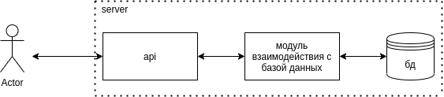

# advertising

<h2>Инструкция по запуску</h2>
<h3>Запуск контейнеров</h3>

В директории ./deployments прописать:
     
    <code>docker-compose up -d</code>
     
    После этого соберутся и запустятся контейнеры для работы с go и postgres

 Посмотреть их названия можно командой:
     
    <code>
        docker ps
    </code>

<h3>Создание пользователя для работы с базой данных </h3>
<ul>
    <li>Войти в контейнере c postgres в учетную запись postgres (пароль - "qwerty"):
     
    <code>docker exec -it deployments_store_1 /bin/bash</code>
     
        <code>psql -U postgres -p 5432 -h store</code>
     
    </li>
    <li>Создать нового пользователя:
     
        <code>CREATE ROLE user1 WITH PASSWORD 'password' LOGIN CREATEDB;</code>
     
    </li>
    <li>Создать базы данных:
     
        <code>CREATE DATABASE user1;
         
        CREATE DATABASE app
        </code>
     
    </li>
</ul>

<h3>Запуск миграций </h3>
<ul>
    <li>
        Зайти в контейнер с golang:
         
        <code>docker exec -it deployments_backend_1 /bin/bash</code>
    </li>
    <li>В директории ./build запустить миграции командой:
     
    <code>migrate -database ${POSTGRESQL_URL} -path ./migrations up</code>
</ul>

<h3>Запуск сервера</h3>
<ul>
    <li>
        В директории ./build необходимо создать .env файл и заполнить его по примеру .env_example(скопировать все из .env_example в .env)
         
        <code>
            cp .env_example .env
        </code>
    </li>
    <li>
        В директории ./build необходимо прописать команду для сборки сервера:
         
            <code>go build ../cmd/app/main.go</code>
         
    </li>
    <li>
        Теперь его можно запустить командой:
         
            <code>./main</code>
         
    </li>
</ul>
<h3>Структура проекта</h3>
<a href="https://github.com/golang-standards/project-layout">https://github.com/golang-standards/project-layout</a>
 
<ul>
    <li>build - содержит все необходимое для запуска и работы сервер: .env, Dockerfile для golang, миграции и файлы базы данных. После сборки сервера здесь появится скомпилированный файл для запуска;</li>
    <li>cmd - содержит main package;</li>
    <li>deployments - содержит файл для docker-compose.yml. Контейнеры запускаются здесь;</li>
    <li>internal - содержит пакеты для работы сервера.
        <ul>
            <li>models - модели сущностей;</li>
            <li>server - конфиг, сервер, роутер и обработчики;</li>
            <li>store - включает в себя две реализации интерфейса для работы с б.д: mock для тестирования http и postgres для работы сервера;</li>
        </ul>
    </li>
</ul>
<h3>Архитектура</h3>

    Пользователь взаимодействием с приложением при помощи rest API. Модуль server обрабатывает входящий запрос на 3000 порту, после чего отправляет его в соответствующий обработчик, расположенный в модуле Store, который в зависимости от бизнес логики записывает данные в базу данных или забирает их из нее. 

<h3>Описание методов сервиса</h3>
<ul>
    <li>
        <h4>Метод создания объявления</h4>
        

        POST /ad
        

        

        пример тела запроса в формате JSON:
        

        <pre>
{
    "name": "iphones",
    "description": "Продам айфон 2",
    "photos": [
        "https://test/image1",
        "https://test/image2",
        "https://test/image3"
    ],
    "price": 124
}
        </pre>
        

        пример отета:
        

        <pre>
в случае успеха
{
    "result": {
        "id": 25,
        "status": "success"
    }
}
в случае неудачи, например если отправлено 4 ссылки на фото
{
    "result": {
        "error": "Key: 'Ad.Links' Error:Field validation for 'Links' failed on the 'max' tag",
        "message": "Некорректный запрос",
        "status": "fail"
    }
}
        </pre>
    </li>
        <li>
        <h4>Метод получения конкретного объявления</h4>
        

        GET /ad/id 
         
        id - id объявления
         
        Чтобы получить дополнительное описание, необходимо добавить в запрос description=true
         
        Чтобы получить все фотографии, необходимо добавить в запрос photos=true. 
        

        

        пример запроса:
        

        <pre>
http://127.0.0.1:3000/ad/3?description=true&photos=true
        </pre>
        

        пример отета:
        

        <pre>
в случае успеха
{
    "result": {
        "name": "iphones",
        "description": "Продам айфон 2",
        "photos": [
            "https://test/image1",
            "https://test/image2",
            "https://test/image3"
        ],
        "price": 100
    }
}
в случае неудачи
{
    "result": {
        "error": "strconv.ParseBool: parsing \"true1\": invalid syntax",
        "message": "Некорректный запрос",
        "status": "fail"
    }
}
        </pre>
    </li>
            <h4>Метод получения всех объявлений</h4>
        

        GET /ads
         
        Чтобы указать номер нужной страницы, необходимо добавить в запрос p=n, где n - положительное число
         
        Чтобы указать по какому полю сортировать, необходимо добавить в запрос sort_by=field, где field может принимать значение price или created_at
         
        Чтобы указать направление сортировки, необходимо добавить в запрос sort_direction=type, где type может принимать значение asc для возрастания или desc для убывания 
        

        

        пример запроса:
        

        <pre>
http://127.0.0.1:3000/ads?p=1&sort_by=price&sort_direction=desc
        </pre>
        

        В ответе содержится массив с объявлениями и общее количество страниц 
         
        пример отета:
        

        <pre>
{
    "result": {
        "data": [
            {
                "name": "iphones",
                "photos": [
                    "https://test/image1"
                ],
                "price": 124
            },
            {
                "name": "iphones",
                "photos": [
                    "https://test/image1"
                ],
                "price": 123
            },
...
        "n_pages": 3
    }
}
        </pre>
    </li>
</ul>
